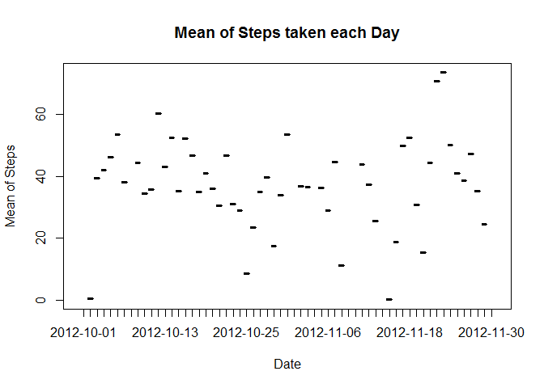

### 1. Code for reading in the dataset and/or processing the data

    if(!file.exists("data"))  {
        dir.create("data")
    }

    if(!file.exists("./data/repdatadataactivity.zip"))  {
        zipFileUrl <- "https://d396qusza40orc.cloudfront.net/repdata%2Fdata%2Factivity.zip?accessType=DOWNLOAD"
        download.file(zipFileUrl, destfile="./data/repdatadataactivity.zip")
    }

    if(!file.exists("./data/activity.csv")) {
        ## check and correct the code to unzip
        unzip("./data/repdatadataactivity.zip", list=FALSE, overwrite=TRUE, exdir=".")
    }

    activitydata <- read.csv("./data/activity.csv")

### 2.Histogram of the total number of steps taken each day

    ## Load plyr Package
        library(plyr)

    ## Warning: package 'plyr' was built under R version 3.2.3

    ## Group by the date and then sum the steps
      act_sum_by_date <- ddply(activitydata, "date", summarise, TotalSteps=sum(steps))

    ## Plot the histogram 
        hist(act_sum_by_date$TotalSteps, 
                    xlab="Total Number of Steps",
                    main="Histogram of Total Number of Steps taken each Day")

### 3.Mean and median number of steps taken each day

### MEAN

    ## Load plyr Package
        library(plyr)

    ## Group by the date and then find mean of the steps
      act_mean_by_date <- ddply(activitydata, "date", summarise, MeanSteps=mean(steps))
        
    ## Print the means
      print(act_mean_by_date)

    ##          date  MeanSteps
    ## 1  2012-10-01         NA
    ## 2  2012-10-02  0.4375000
    ## 3  2012-10-03 39.4166667
    ## 4  2012-10-04 42.0694444
    ## 5  2012-10-05 46.1597222
    ## 6  2012-10-06 53.5416667
    ## 7  2012-10-07 38.2465278
    ## 8  2012-10-08         NA
    ## 9  2012-10-09 44.4826389
    ## 10 2012-10-10 34.3750000
    ## 11 2012-10-11 35.7777778
    ## 12 2012-10-12 60.3541667
    ## 13 2012-10-13 43.1458333
    ## 14 2012-10-14 52.4236111
    ## 15 2012-10-15 35.2048611
    ## 16 2012-10-16 52.3750000
    ## 17 2012-10-17 46.7083333
    ## 18 2012-10-18 34.9166667
    ## 19 2012-10-19 41.0729167
    ## 20 2012-10-20 36.0937500
    ## 21 2012-10-21 30.6284722
    ## 22 2012-10-22 46.7361111
    ## 23 2012-10-23 30.9652778
    ## 24 2012-10-24 29.0104167
    ## 25 2012-10-25  8.6527778
    ## 26 2012-10-26 23.5347222
    ## 27 2012-10-27 35.1354167
    ## 28 2012-10-28 39.7847222
    ## 29 2012-10-29 17.4236111
    ## 30 2012-10-30 34.0937500
    ## 31 2012-10-31 53.5208333
    ## 32 2012-11-01         NA
    ## 33 2012-11-02 36.8055556
    ## 34 2012-11-03 36.7048611
    ## 35 2012-11-04         NA
    ## 36 2012-11-05 36.2465278
    ## 37 2012-11-06 28.9375000
    ## 38 2012-11-07 44.7326389
    ## 39 2012-11-08 11.1770833
    ## 40 2012-11-09         NA
    ## 41 2012-11-10         NA
    ## 42 2012-11-11 43.7777778
    ## 43 2012-11-12 37.3784722
    ## 44 2012-11-13 25.4722222
    ## 45 2012-11-14         NA
    ## 46 2012-11-15  0.1423611
    ## 47 2012-11-16 18.8923611
    ## 48 2012-11-17 49.7881944
    ## 49 2012-11-18 52.4652778
    ## 50 2012-11-19 30.6979167
    ## 51 2012-11-20 15.5277778
    ## 52 2012-11-21 44.3993056
    ## 53 2012-11-22 70.9270833
    ## 54 2012-11-23 73.5902778
    ## 55 2012-11-24 50.2708333
    ## 56 2012-11-25 41.0902778
    ## 57 2012-11-26 38.7569444
    ## 58 2012-11-27 47.3819444
    ## 59 2012-11-28 35.3576389
    ## 60 2012-11-29 24.4687500
    ## 61 2012-11-30         NA

    ## Plot the Graph (Base Plotting System)
        plot(act_mean_by_date$date, act_mean_by_date$MeanSteps, 
                    type="l", xlab="Date", ylab="Mean of Steps",
                    main="Mean of Steps taken each Day")

### MEDIAN

    ## Load plyr Package
        library(plyr)

    ## Group by the date and then find the median of the steps
      act_median_by_date <- ddply(activitydata, "date", summarise, MedianSteps=median(steps))
      
    ## Print the medians
      print(act_median_by_date)

    ##          date MedianSteps
    ## 1  2012-10-01          NA
    ## 2  2012-10-02           0
    ## 3  2012-10-03           0
    ## 4  2012-10-04           0
    ## 5  2012-10-05           0
    ## 6  2012-10-06           0
    ## 7  2012-10-07           0
    ## 8  2012-10-08          NA
    ## 9  2012-10-09           0
    ## 10 2012-10-10           0
    ## 11 2012-10-11           0
    ## 12 2012-10-12           0
    ## 13 2012-10-13           0
    ## 14 2012-10-14           0
    ## 15 2012-10-15           0
    ## 16 2012-10-16           0
    ## 17 2012-10-17           0
    ## 18 2012-10-18           0
    ## 19 2012-10-19           0
    ## 20 2012-10-20           0
    ## 21 2012-10-21           0
    ## 22 2012-10-22           0
    ## 23 2012-10-23           0
    ## 24 2012-10-24           0
    ## 25 2012-10-25           0
    ## 26 2012-10-26           0
    ## 27 2012-10-27           0
    ## 28 2012-10-28           0
    ## 29 2012-10-29           0
    ## 30 2012-10-30           0
    ## 31 2012-10-31           0
    ## 32 2012-11-01          NA
    ## 33 2012-11-02           0
    ## 34 2012-11-03           0
    ## 35 2012-11-04          NA
    ## 36 2012-11-05           0
    ## 37 2012-11-06           0
    ## 38 2012-11-07           0
    ## 39 2012-11-08           0
    ## 40 2012-11-09          NA
    ## 41 2012-11-10          NA
    ## 42 2012-11-11           0
    ## 43 2012-11-12           0
    ## 44 2012-11-13           0
    ## 45 2012-11-14          NA
    ## 46 2012-11-15           0
    ## 47 2012-11-16           0
    ## 48 2012-11-17           0
    ## 49 2012-11-18           0
    ## 50 2012-11-19           0
    ## 51 2012-11-20           0
    ## 52 2012-11-21           0
    ## 53 2012-11-22           0
    ## 54 2012-11-23           0
    ## 55 2012-11-24           0
    ## 56 2012-11-25           0
    ## 57 2012-11-26           0
    ## 58 2012-11-27           0
    ## 59 2012-11-28           0
    ## 60 2012-11-29           0
    ## 61 2012-11-30          NA

    ## Plot the Graph (Base Plotting System)
        plot(act_median_by_date$date, act_median_by_date$MedianSteps, 
                    type="l", xlab="Date", ylab="Median of Steps",
                    main="Median of Steps taken each Day")

