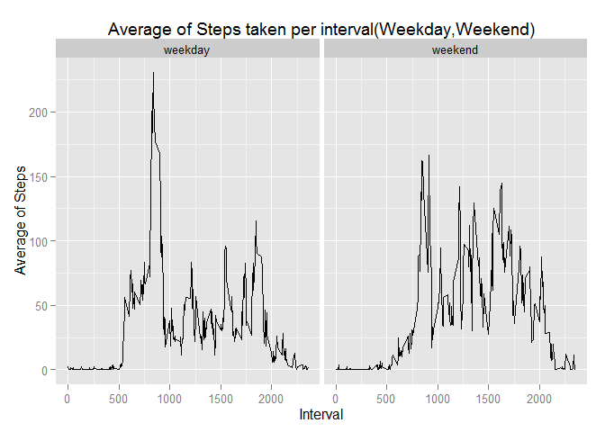

### 1. Code for reading in the dataset and/or processing the data

    if(!file.exists("data"))  {
        dir.create("data")
    }

    if(!file.exists("./data/repdatadataactivity.zip"))  {
        zipFileUrl <- "https://d396qusza40orc.cloudfront.net/repdata%2Fdata%2Factivity.zip?accessType=DOWNLOAD"
        download.file(zipFileUrl, destfile="./data/repdatadataactivity.zip")
    }

    if(!file.exists("./data/activity.csv")) {
        ## code to unzip
        unzip("./data/repdatadataactivity.zip", list=FALSE, overwrite=TRUE, exdir=".")
    }

    activitydata <- read.csv("./data/activity.csv")

### 2.Histogram of the total number of steps taken each day

    ## Load plyr Package
        library(plyr)

    ## Warning: package 'plyr' was built under R version 3.2.3

    ## Group by the date and then sum the steps
      act_sum_by_date <- ddply(activitydata, "date", summarise, TotalSteps=sum(steps))

    ## Plot the histogram 
        hist(act_sum_by_date$TotalSteps, 
                    xlab="Total Number of Steps",
                    main="Histogram of Total Number of Steps taken each Day")

### 3.Mean and median number of steps taken each day

    ## Load plyr Package
        library(plyr)

    ## Use Summary to Calculate the Mean and Median 
    ## Print the Mean and Median
      stepssummary <- summary(act_sum_by_date[,2])
      stepsmean <- stepssummary[4]
      stepsmedian <- stepssummary[3]
      print(stepsmean)

    ##  Mean 
    ## 10770

      print(stepsmedian)

    ## Median 
    ##  10760

### 4.Time series plot of the average number of steps taken

    ## Load plyr, ggplot2 Package
        library(plyr)
        library(ggplot2)

    ## Warning: package 'ggplot2' was built under R version 3.2.3

    ## Group by the interval and then find the mean of the steps
      act_avg_by_interval <- ddply(activitydata, "interval", summarise, mean(steps,na.rm=TRUE))
      colnames(act_avg_by_interval )[2] <- "AverageSteps"
      
    ## Finding the range for interval
        int_range <- range(0,  act_avg_by_interval$interval)

    ## Plot the Graph (ggplot2)
        ThePlot <- qplot(interval, AverageSteps, data=act_avg_by_interval,
              geom="line", method="lm",xlab="Interval", ylab="Average of Steps", 
                    main="Average of Steps taken per interval", xlim=int_range)
        
        ## Printing the Plot
        print(ThePlot)

### 5. The 5-minute interval that, on average, contains the maximum number of steps

    act_order <- act_avg_by_interval[order(act_avg_by_interval[,2]),]

    act_max <- tail(act_order,1)
    colnames(act_max )[1] <- "Interval"
    colnames(act_max )[2] <- "Highest Average Step" 

    print(act_max)

    ##     Interval Highest Average Step
    ## 104      835             206.1698

### 6. Code to describe and show a strategy for imputing missing data

### a. Calculate and report the total number of missing values in the dataset (i.e. the total number of rows with NAs)

    act_order <- act_avg_by_interval[order(act_avg_by_interval[,2]),]

    thecount <- nrow(activitydata[which(is.na(activitydata$steps) == TRUE), ])

    print(thecount)

    ## [1] 2304

### b. Strategy for filling in all of the missing values in the dataset. Have used the mean for that 5-minute interval, etc.

    activitydatafilled <- activitydata
    thetotalCount <- nrow(activitydatafilled)

    for (i in 1:thetotalCount)
    {
      if (is.na(activitydatafilled[i,"steps"])==TRUE) 
        {  
            activitydatafilled[i,"steps"]<-act_avg_by_interval[which(act_avg_by_interval$interval == activitydatafilled[i,"interval"]),2]  
      }  
    }

    thenewcountofNA <- nrow(activitydatafilled[which(is.na(activitydatafilled$steps) == TRUE), ])

    print(thenewcountofNA)

    ## [1] 0

    ## All NAs filled. So the new count of NA displays 0

### 7 (a).Histogram of the total number of steps taken each day - After imputing the missing Values

    ## Load plyr Package
        library(plyr)

    ## Group by the date and then sum the steps
      act_sum_by_date_filled <- ddply(activitydatafilled, "date", summarise, TotalStepsFilled=sum(steps))

    ## Plot the histogram 
        hist(act_sum_by_date_filled$TotalStepsFilled, 
                    xlab="Total Number of Steps",
                    main="Histogram of Total No. of Steps taken each Day (With No missing values)")

### 7 (b).Mean and median number of steps taken each day - With No missing Values

    ## Load plyr Package
        library(plyr)

    ## Use Summary to Calculate the Mean and Median 
    ## Print the Mean and Median
      stepssummaryfilled <- summary(act_sum_by_date_filled[,2])
      stepsmeanfilled <- stepssummaryfilled[4]
      stepsmedianfilled <- stepssummaryfilled[3]
      print(stepsmeanfilled)

    ##  Mean 
    ## 10770

      print(stepsmedianfilled)

    ## Median 
    ##  10770

### 8. Panel plot comparing the average number of steps taken per 5-minute interval across weekdays and weekends

    ## Load plyr Package
        library(plyr)

      thetempframe <- data.frame("daytype")
      activitydatafilled <- cbind(activitydatafilled,thetempframe)
      colnames(activitydatafilled )[4] <- "daytype"
      levels(activitydatafilled$daytype) <- c(levels(activitydatafilled$daytype), "weekday")
      levels(activitydatafilled$daytype) <- c(levels(activitydatafilled$daytype), "weekend")
      str(activitydatafilled)

    ## 'data.frame':    17568 obs. of  4 variables:
    ##  $ steps   : num  1.717 0.3396 0.1321 0.1509 0.0755 ...
    ##  $ date    : Factor w/ 61 levels "2012-10-01","2012-10-02",..: 1 1 1 1 1 1 1 1 1 1 ...
    ##  $ interval: int  0 5 10 15 20 25 30 35 40 45 ...
    ##  $ daytype : Factor w/ 3 levels "daytype","weekday",..: 1 1 1 1 1 1 1 1 1 1 ...

      thetotalCount <- nrow(activitydatafilled)

      for (i in 1:thetotalCount)
      {
        
        if (weekdays(as.Date(activitydatafilled[i,"date"], "%Y-%m-%d")) == 
            "Saturday" | 
            weekdays(as.Date(activitydatafilled[i,"date"], "%Y-%m-%d")) == 
            "Sunday") 
          {  
              activitydatafilled[i,"daytype"]<-"weekend"
        }
        else
        {
            activitydatafilled[i,"daytype"]<-"weekday"
        }
      }
      ## The following shows that the daytype has been filled now
      head(activitydatafilled)

    ##       steps       date interval daytype
    ## 1 1.7169811 2012-10-01        0 weekday
    ## 2 0.3396226 2012-10-01        5 weekday
    ## 3 0.1320755 2012-10-01       10 weekday
    ## 4 0.1509434 2012-10-01       15 weekday
    ## 5 0.0754717 2012-10-01       20 weekday
    ## 6 2.0943396 2012-10-01       25 weekday

        library(plyr)
        library(ggplot2)

      act_avg_by_interval2 <- ddply(activitydatafilled, .(interval,daytype), summarise, mean(steps,na.rm=TRUE))
      colnames(act_avg_by_interval2 )[3] <- "AverageSteps"
      
    ## Finding the range for interval
        int_range <- range(0,  act_avg_by_interval2$interval)
      
    ## Plot the Graph (ggplot2)
        ThePlot2 <- qplot(interval, AverageSteps, facets=.~daytype, data=act_avg_by_interval2,
              geom="line", method="lm",xlab="Interval", ylab="Average of Steps", 
                    main="Average of Steps taken per interval(Weekday,Weekend)", xlim=int_range)
        
        ## Printing the Plot
        print(ThePlot2)

